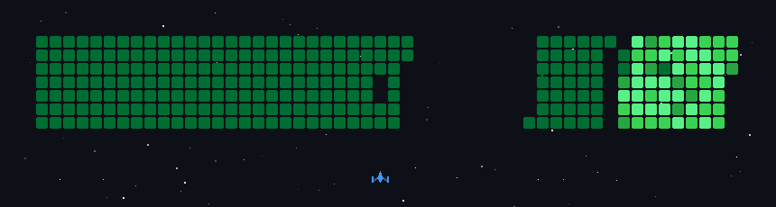

<div align="center">

<h1>
  
</h1>

</div>

<table width="100%">
<tr>
<td width="68%" valign="right">


I am an **AI & ML Engineer** specializing in **Generative AI**, **LLMs**, and **Applied Machine Learning**, with hands-on experience in building **scalable, production-ready AI systems**. I have designed and deployed **intelligent platforms**, **RAG-based assistants**, **geospatial AI tools**, and **voice-driven agents** for **healthcare, compliance, and urban planning**. My expertise spans **LLM orchestration**, **vector search**, **prompt engineering**, and **full-stack AI integration**. I'm passionate about transforming **complex ideas** into **reliable, real-world AI solutions** that deliver **measurable impact**.

</td>

<td width="32%" align="left">


</td>
</tr>
</table>


<div align="center">
  
  <br/>
  
</div>

<br/>

<div align="center">

<a href="https://www.linkedin.com/in/afnan-sharif/"></a>
<a href="https://github.com/AfnanSharif"></a>
<a href="mailto:afnansharifs@gmail.com"></a>

</div>


<div align="center">
  
  <br/>
  
</div>

<br/>

<div align="center">

[](https://skillicons.dev)

</div>


<b>A little more about me...</b>

```python
const afnan = {
  name: "Afnan Sharif",
  title: "AI & ML Engineer",
  skills: ["Generative AI", "LLMs", "RAG", "Computer Vision", "Applied ML"],
  stack: ["Python", "FastAPI", "LangChain", "PyTorch", "TensorFlow", "Docker", "DigitalOcean"],
  projects: ["IntelliScan", "GeoQuery AI"],
  quote: "Turning complex ideas into real-world AI solutions 🚀",
};

console.log(`👋 I'm ${afnan.name}, a ${afnan.title} passionate about ${afnan.skills.join(", ")}.`);

```

  <picture>
  <source media="(prefers-color-scheme: dark)" srcset="https://raw.githubusercontent.com/AfnanSharif/AfnanSharif/output/github-contribution-grid-snake-dark.svg" />
  <source media="(prefers-color-scheme: light)" srcset="https://raw.githubusercontent.com/AfnanSharif/AfnanSharif/output/github-contribution-grid-snake.svg" />
  
</picture>

<div align="center">
  
  <br/>
  
</div>

<br/>

<div align="center" style="display: flex; flex-wrap: wrap; justify-content: center; gap: 10px;">

  <!-- 🔥 GitHub Streak -->
  

</div>

<div align="center">

[](https://github.com/stats-organization/github-stats-extended)

</div>

<br>

<!-- 👾 Contributions Space Shooter Game -->
<div align="center">
  
</div>

<br>

<!-- 🧩 Activity Graph -->
<div align="center">
  
</div>

<br>

<br>


