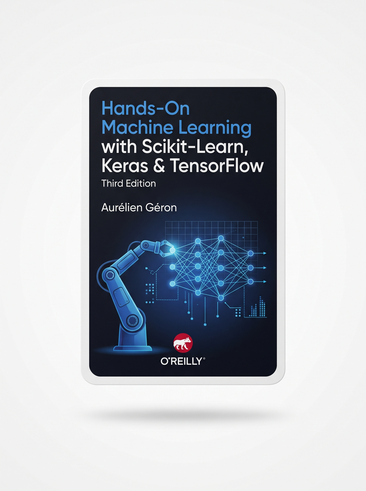
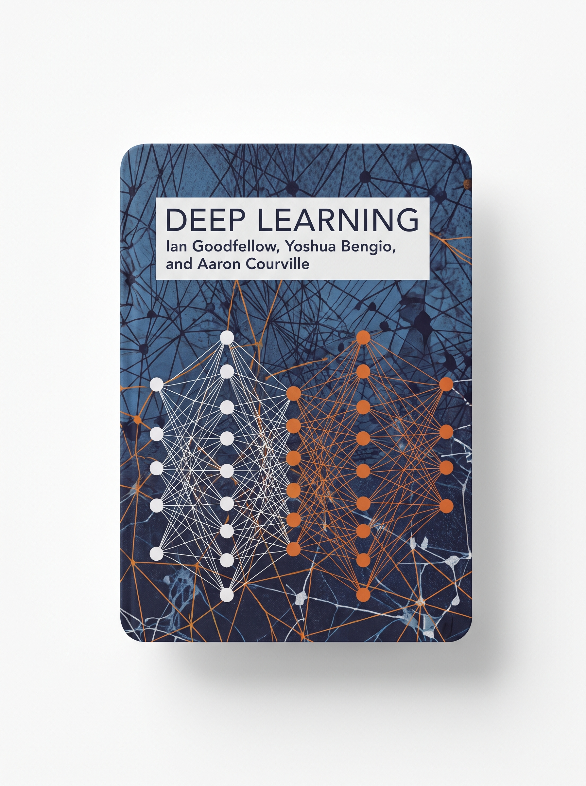
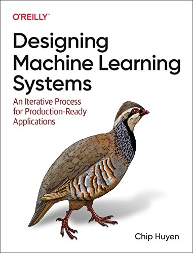
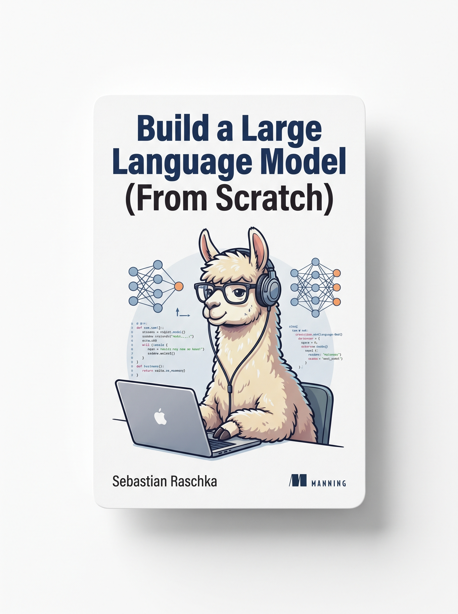
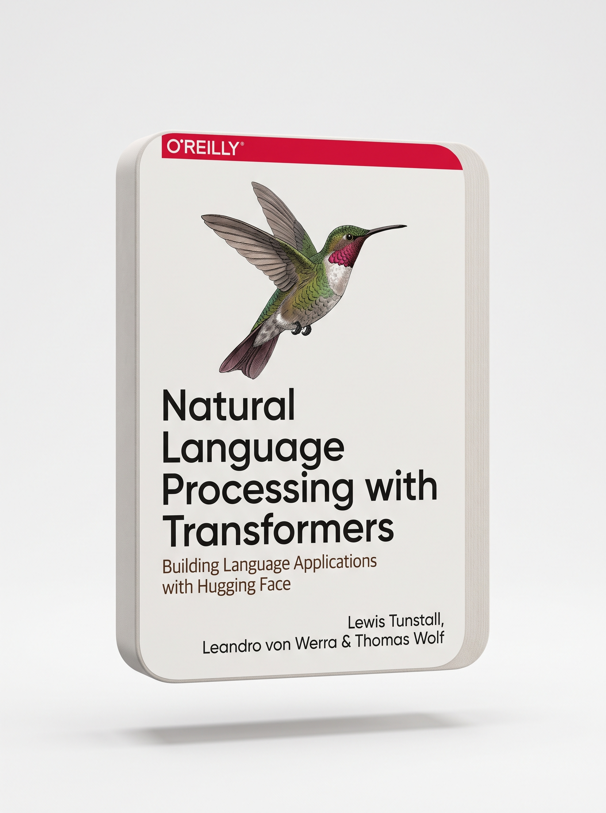
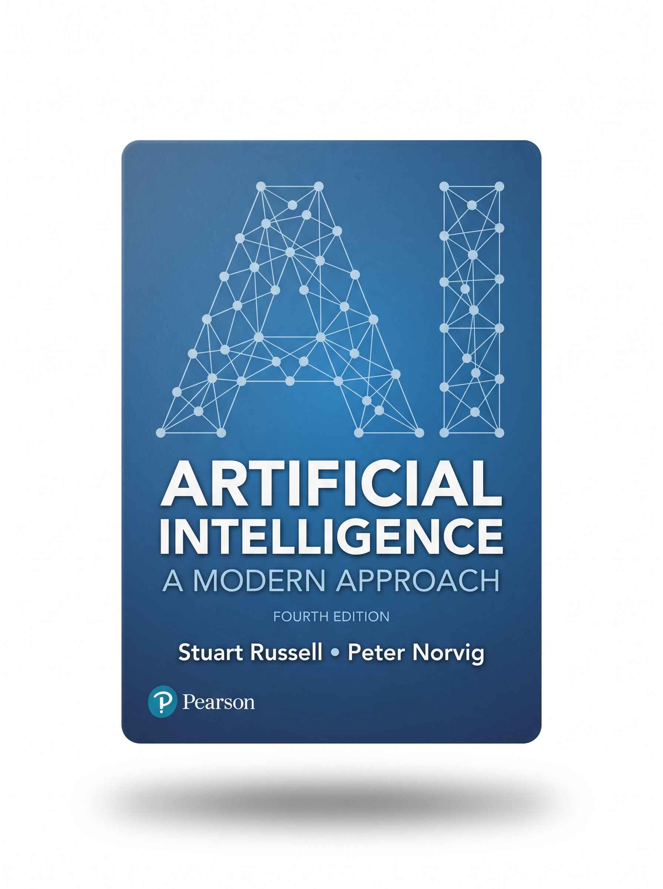

<div align="center">

<h1>
  
</h1>

</div>


<br>
<br>

I am an **AI & ML Engineer** specializing in **Generative AI**, **LLMs**, and **Applied Machine Learning**, with hands-on experience in building **scalable, production-ready AI systems**. I have designed and deployed **intelligent platforms**, **RAG-based assistants**, **geospatial AI tools**, and **voice-driven agents** for **healthcare, compliance, and urban planning**. My expertise spans **LLM orchestration**, **vector search**, **prompt engineering**, and **full-stack AI integration**. I'm passionate about transforming **complex ideas** into **reliable, real-world AI solutions** that deliver **measurable impact**.

<br clear="right"/>


<div align="left">
  
</div>

<br/>

<div align="center">

<a href="https://www.linkedin.com/in/afnan-sharif/"></a>
<a href="https://github.com/AfnanSharif"></a>
<a href="mailto:afnansharifs@gmail.com"></a>

</div>


<div align="left">
  
</div>

<br/>

<div align="center">

[](https://skillicons.dev)

</div>


<div align="left">
  
</div>

- **[GraphRAG](https://github.com/AfnanSharif/GraphRAG)** — Python · Retrieval-augmented generation over knowledge graphs.
- **[GenerativeAI-LLM](https://github.com/AfnanSharif/GenerativeAI-LLM)** — Python · Generative AI / LLM experimentation and pipelines.
- **[AeroDetect](https://github.com/AfnanSharif/AeroDetect)** — Python · Computer-vision detection project.
- **[PyTorchAutoencoders](https://github.com/AfnanSharif/PyTorchAutoencoders)** — Python · Autoencoder architectures implemented in PyTorch.
- **[CuraMind](https://github.com/AfnanSharif/CuraMind)** — Jupyter Notebook · Healthcare-focused AI/ML exploration.
- **[LeafSense](https://github.com/AfnanSharif/LeafSense)** — Python · Computer-vision project for plant/leaf detection.

<br/>

<!-- <b>A little more about me...</b> -->

<div align="left">
  
</div>

```python
const afnan = {
  name: "Afnan Sharif",
  title: "AI & ML Engineer",

  languages: ["Python", "SQL"],
  llm_ai_frameworks: ["LangChain", "LlamaIndex", "OpenAI API", "Hugging Face",
                       "RAG Pipelines", "Prompt Engineering", "Structured Output Generation",
                       "Function Calling", "Vector Search (Qdrant, Pinecone)"],
  ml_nlp: ["Supervised & Unsupervised Learning", "Neural Networks", "Text Classification",
           "Embedding Generation", "Sentiment Analysis", "Information Extraction"],
  computer_vision_geospatial: ["YOLOv8/YOLOv11", "Detectron2", "Mask R-CNN", "OpenCV",
                                "scikit-image", "DeepSeek OCR", "RunPulse OCR",
                                "Azure Form Recognizer", "OCR & Document Parsing",
                                "GDAL", "GeoPandas", "Shapely", "Rasterio", "QGIS"],
  backend_web: ["FastAPI", "Flask", "NestJS", "REST API Development", "Web Scraping", "Playwright"],
  deployment_devops: ["Docker", "Git", "GitHub", "CI/CD", "Linux Server Administration", "Nginx", "Systemd"],
  data_processing_storage: ["Pandas", "NumPy", "PostgreSQL (pgvector)", "MongoDB",
                             "SQLite", "Redis", "Elasticsearch"],
  voice_chat_interfaces: ["GPT-4o", "ElevenLabs", "OpenAI Whisper", "InsightFace",
                           "Biometric Verification", "AI-Powered Voice Agents"],
  frameworks_libraries: ["TensorFlow", "PyTorch", "Scikit-learn"],

  quote: "Turning complex ideas into real-world AI solutions 🚀",
};

console.log(`👋 I'm ${afnan.name}, a ${afnan.title}.`);

```

<div align="left">

  

</div>

<br>

<p align="center">

<a href="https://www.amazon.com/dp/1098125975">

</a>
&nbsp;&nbsp;&nbsp;

<a href="https://www.amazon.com/dp/0262035618">

</a>
&nbsp;&nbsp;&nbsp;

<a href="https://www.amazon.com/dp/1098107969">

</a>

</p>

<p align="center">

<a href="https://www.amazon.com/dp/1633437167">

</a>
&nbsp;&nbsp;&nbsp;

<a href="https://www.amazon.com/dp/1098136799">

</a>
&nbsp;&nbsp;&nbsp;

<a href="https://www.amazon.com/dp/0134610997">

</a>

</p>

<!-- 
  <picture>
  <source media="(prefers-color-scheme: dark)" srcset="https://raw.githubusercontent.com/AfnanSharif/AfnanSharif/output/github-contribution-grid-snake-dark.svg" />
  <source media="(prefers-color-scheme: light)" srcset="https://raw.githubusercontent.com/AfnanSharif/AfnanSharif/output/github-contribution-grid-snake.svg" />
  
</picture> -->


<!-- 👾 Contributions Space Shooter Game -->
<div align="center">
  
</div>

<!-- <div align="center">
  &nbsp;&nbsp;
</div> -->

<br/>

<div align="center">

<a href="https://github.com/AfnanSharif"></a>

</div>

<br>


<br>

<!-- 🧩 Activity Graph -->
<div align="center">
  
</div>

<br>

<br>


